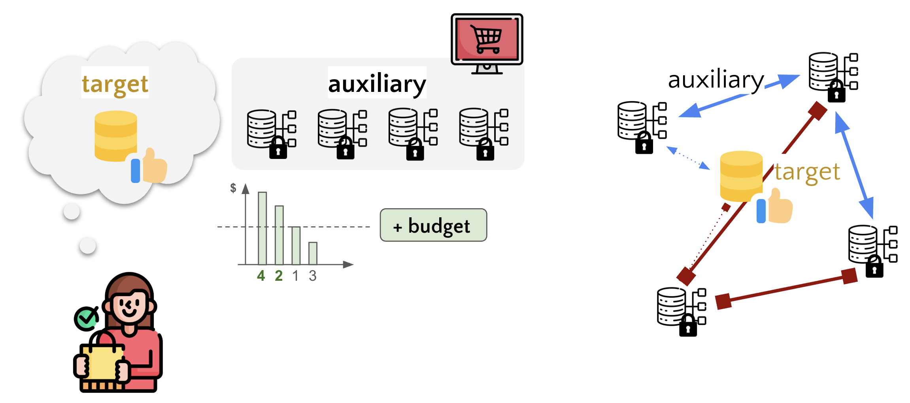

# Convex Dataset Valuation for Post-Training

[](https://arxiv.org/abs/2605.16704)
[](https://github.com/uiuctml/convex_data_valuation)
[](https://icml.cc/media/icml-2026/Slides/61645.pdf)
[](https://icml.cc/media/PosterPDFs/ICML%202026/61645.png?t=1781058738.7097435)



This is the official repository implementing the convex dataset valuation method from [*Convex Dataset Valuation for Post-Training*](https://arxiv.org/abs/2605.16704) at ICML 2026.

## Introduction

Improving LLM performance on downstream tasks sometimes requires leveraging auxiliary datasets during post-training. In practice, however, developers face constraints on compute, labeling, and licensing costs that preclude using all available data, necessitating principled dataset-level selection. These constraints are increasingly shaped by dataset marketplaces, where data acquisition is governed by budgets and negotiation. We study dataset valuation as a subset selection problem during LLM post-training. Our goal is to identify and weight auxiliary datasets so as to maximize target task performance given constrained budgets. We first show that commonly used gradient alignment scores provide a reasonable yet incomplete valuation signal, as they ignore redundancy among datasets. To address this, we propose a scalable convex dataset-level valuation method based on kernel mean matching (KMM) in gradient space, which jointly accounts for alignment with the target task and redundancy across auxiliary datasets. Through extensive experiments across diverse post-training settings and tasks, we show that our approach consistently outperforms existing valuation baselines, achieving stronger performance with low computational overhead. Our results position dataset valuation as a practical decision tool for post-training data selection in market-constrained large language model settings.

## Environment Setup

### Prerequisites

- Conda package manager
- CUDA-compatible GPU

### Create and Activate Environment

```bash
# Create the conda environment
conda create -n data_selection python=3.10 -y
conda activate data_selection

# Install all dependencies (frozen versions)
pip install -r requirements.txt

# Install lm-evaluation-harness (local edited version for multilingual-math evaluation)
# See: https://github.com/EleutherAI/lm-evaluation-harness/issues/3390
pip install -e lm-evaluation-harness
```

### Verify Installation

```bash
conda activate data_selection
python -c "import torch; print(f'PyTorch: {torch.__version__}, CUDA: {torch.cuda.is_available()}')"
```

### Required Environment Variables

Before running any scripts, you must set the following environment variables:

| Variable | Description | Example |
|----------|-------------|---------|
| `PROJECT_ROOT` | Absolute path to the `multisource_data` directory | `/home/user/multisource_data` |
| `DATA_DIR` | Directory for storing outputs, checkpoints, and logs | `/home/user/data` |

**Optional:**

| Variable | Description | Default |
|----------|-------------|---------|
| `NCCL_SOCKET_IFNAME` | Network interface for NCCL distributed training | `eno1` |

Add these to your shell configuration (e.g., `~/.bashrc`) or set them before running scripts:

```bash
export PROJECT_ROOT=/path/to/multisource_data
export DATA_DIR=/path/to/data/storage
```

## Project Structure

```
multisource_data/
├── attribution/          # Data attribution methods
├── configs/              # Training configuration YAML files
│   ├── sft/              # SFT experiment configs
│   └── grpo/             # GRPO experiment configs
├── data/                 # Data modules for different datasets
│   ├── aya/              # AYA multilingual instruction dataset
│   ├── big_math_gsm8k/   # Multilingual math reasoning dataset
│   └── tulu_personas/    # Tulu persona instruction-following dataset
├── lm-evaluation-harness/# Evaluation framework (local edited version)
├── modeling/             # Model parameter configurations
├── scripts/              # Shell scripts for running experiments
│   ├── sft/              # SFT training scripts
│   └── grpo/             # GRPO training scripts
├── trainer/              # Training orchestration
├── utils/                # Utility functions
├── run.py                # Main entry point
└── requirements.txt      # Python dependencies
```

## Configuration

Configuration files are located in `configs/` and organized by training paradigm:

### SFT Configuration Example

```yaml
# configs/sft/exp_attribution_danish_multitask.yaml
model_name: Qwen/Qwen3-1.7B
dataset: CohereLabs/aya_dataset
target_task: danish
lora:
  r: 8
  alpha: 16
```

### GRPO Configuration Example

```yaml
# configs/grpo/exp_qwen2.5_1.5b_instruct_big_math_gsm8k_th.yaml
model_name: Qwen/Qwen2.5-1.5B-Instruct
dataset: cindy2000sh/Big-Math-RL-GSM8K-googletrans
target_task: thai
grpo:
  num_generations: 8
  temperature: 0.6
  beta: 0.005
```

## Running Experiments

### Basic Training

```bash
conda activate data_selection

# Set required environment variables (add to ~/.bashrc for persistence)
export PROJECT_ROOT=/path/to/multisource_data
export DATA_DIR=/path/to/data/storage

python run.py --cfg configs/<config_file>.yaml
```

### Running Scripts

All experiment scripts are located in `scripts/` and organized by training paradigm and dataset.

**Important:** Ensure `PROJECT_ROOT` and `DATA_DIR` environment variables are set before running any scripts.

#### SFT with AYA Dataset

```bash
conda activate data_selection
export PROJECT_ROOT=/path/to/multisource_data
export DATA_DIR=/path/to/data/storage

# Data model attribution
bash scripts/sft/aya/danish_datamodel.sh

# Compressed sensing data model
bash scripts/sft/aya/danish_cs_datamodel.sh

# Data model refitting
bash scripts/sft/aya/danish_datamodel_refit.sh

# KMM attribution
bash scripts/sft/aya/danish_kmm.sh

# One-step gradient attribution
bash scripts/sft/aya/danish_one_step.sh

# Task vector attribution
bash scripts/sft/aya/danish_task_vector.sh

# Run from precomputed scores
bash scripts/sft/aya/danish_run_from_scores.sh
```

#### GRPO with Big Math GSM8K Dataset

```bash
conda activate data_selection
export PROJECT_ROOT=/path/to/multisource_data
export DATA_DIR=/path/to/data/storage

# Start vLLM server (required for GRPO)
bash scripts/grpo/vllm_server.sh

# In another terminal, run attribution methods:

# KMM attribution
bash scripts/grpo/big_math_gsm8k/thai_kmm.sh

# One-step gradient attribution
bash scripts/grpo/big_math_gsm8k/thai_one_step.sh

# Task vector attribution
bash scripts/grpo/big_math_gsm8k/thai_task_vector.sh

# Run from precomputed scores
bash scripts/grpo/big_math_gsm8k/thai_run_from_scores.sh
```

#### Evaluation Server

```bash
# For SFT evaluation
bash scripts/sft/lmeval_server.sh

# For GRPO evaluation
bash scripts/grpo/lmeval_server.sh
```

### Script Configuration Notes

Some scripts require editing before use:

- **KMM scripts** (`*_kmm.sh`): Update `KMM_ARTIFACTS_DIR` to point to the artifacts folder from a previous `one_step` attribution run.
- **Run from scores scripts** (`*_run_from_scores.sh`): Update the `FOLDERS` array with the exact subfolder names from your attribution runs (each should contain a `scores.json` file).
- **Datamodel refit scripts** (`*_datamodel_refit.sh`): Update `UNIFORM_ARTIFACTS_DIR` or `CS_ARTIFACTS_DIR` to point to previous datamodel run artifacts.

## Attribution Methods

The framework supports multiple data attribution methods:

| Method | Script Suffix | Description |
|--------|---------------|-------------|
| `one_step` | `_one_step.sh` | Single gradient step attribution |
| `task_vector` | `_task_vector.sh` | Task vector-based attribution |
| `kmm` | `_kmm.sh` | Kernel Mean Matching (requires precomputed gradients) |
| `uniform_data_model` | `_datamodel.sh` | Uniform sampling with data modeling |
| `cs_data_model` | `_cs_datamodel.sh` | Compressed sensing data model |
| `datamodel_refit` | `_datamodel_refit.sh` | Data model refitting approach |

## Supported Datasets

### AYA Dataset (SFT)
- **Source:** `CohereLabs/aya_dataset`
- **Languages:** Arabic, Bengali, Danish, German, English, Spanish, Basque, French, Gujarati, Hindi, Hungarian, Indonesian, Italian, Kannada, Malayalam, Marathi, Dutch, Portuguese, Russian, Serbian, Swedish, Tamil, Telugu, Ukrainian, Vietnamese, Chinese

### Big Math GSM8K (GRPO)
- **Source:** `cindy2000sh/Big-Math-RL-GSM8K-googletrans`
- **Languages:** English, Chinese, German, French, Spanish, Portuguese, Italian, Dutch, Russian, Czech, Polish, Arabic, Farsi, Hebrew, Turkish, Japanese, Korean, Vietnamese, Thai, Indonesian, Malay, Lao, Burmese, Cebuano, Khmer, Tagalog, Hindi, Bengali, Urdu

## Output

- **Training outputs, checkpoints, and logs:** Saved to `${DATA_DIR}/outputs_*/` directories
- **Datamodel caching:** Saved to local `outputs/datamodel_cache/` directory
- **Experiment tracking:** Weights & Biases (wandb)

## Citation

```bibtex
@inproceedings{
zeng2026convex,
title={Convex Dataset Valuation for Post-Training},
author={Siqi Zeng and Christopher Jung and Rui Li and Zhe Kang and Ming Li and Nima Noorshams and Zhigang Wang and Fuchun Peng and Han Zhao and Xue Feng},
booktitle={Forty-third International Conference on Machine Learning},
year={2026},
url={https://openreview.net/forum?id=oAAL0wZSMF}
}
```
